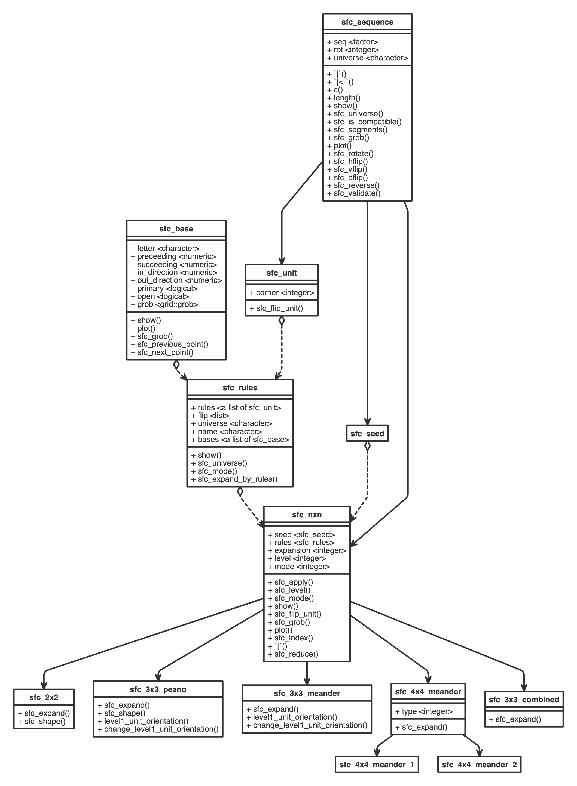

## Functions

Here lists the major high-level functions implemented in this package.

### Make curves

Make general curves:

`sfc_2x2()`, `sfc_3x3_peano()`, `sfc_3x3_meander()`, `sfc_h()`.

Make curves in their standard forms:

`hilbert_curve()`, `moore_curve()`, `beta_omega_curve()`, `peano_curve()`, `meander_curve()`, 
`h_curve()`.

Other curves:

`sfc_3x3_combined()`, `sfc_4x4_meander()`, `hilbert_3d()`.

Generate nxn curves based on specific level-1 units:

`sfc_generator()`

### Expansion rules

Pre-defined expansion rules:

`SFC_RULES_2x2`, `SFC_RULES_3x3_PEANO`, `SFC_RULES_3x3_MEANDER`,
`SFC_RULES_3x3_COMBINED`, `SFC_RULES_4x4_MEANDER_1`, `SFC_RULES_4x4_MEANDER_2`.

Draw these rules:

`draw_rules_2x2()`, `draw_rules_3x3_peano()`, `draw_rules_3x3_meander()`,
`draw_rules_3x3_combined()`, `draw_rules_4x4_meander()`.

### Unit flipping

`sfc_apply()`, `unit_orientation()`, `sfc_flip_unit()`,

`level1_unit_orientation()`, `change_level1_unit_orientation()`.


### Coordinates of segments

`sfc_segments()`

#### Shapes

`sfc_shape()`, `all_2x2_shapes()`, `all_3x3_peano_shapes()`, `all_3x3_meander_shapes()`.

## Classes

There are the following classes defined:

- `sfc_sequence`: the most general class for a sequence of letters.
- `sfc_seed`: essentially the same as `sfc_sequence`. This class is used as a mark representing
   the object can only be used as the seed for generating curves.
- `sfc_unit`: only used when constructing the expansion rules. It is a sequence on level-1 of the curve. 
   There is also an additional slot `corner` which corresponds to the corners of the in and out-direction
   of the square level-1 unit.
- `sfc_nxn`: the base class for the general nxn curves.
- `sfc_2x2`, `sfc_3x3_peano`, `sfc_3x3_meander`, `sfc_3x3_combined`, `sfc_meander_4x4` are all child classes of `sfc_nxn`.
- Specifically `sfc_meander_4x4` has two child classes `sfc_meander_4x4_1` and `sfc_meander_4x4_2` using two different
  sets of expansion rules.

The following two classes define how the curve is expanded:

- `sfc_base`: for the base patterns (i.e. level-0). It defines the previous point and the next points
- `sfc_rules`: It contains the expansion rules from level-0 to level-1.


The UML of classes and their corresponding methods implemented in this package (made by [nomnoml](https://www.nomnoml.com/)).


```{r, echo = FALSE, out.width = "100%"}

```

