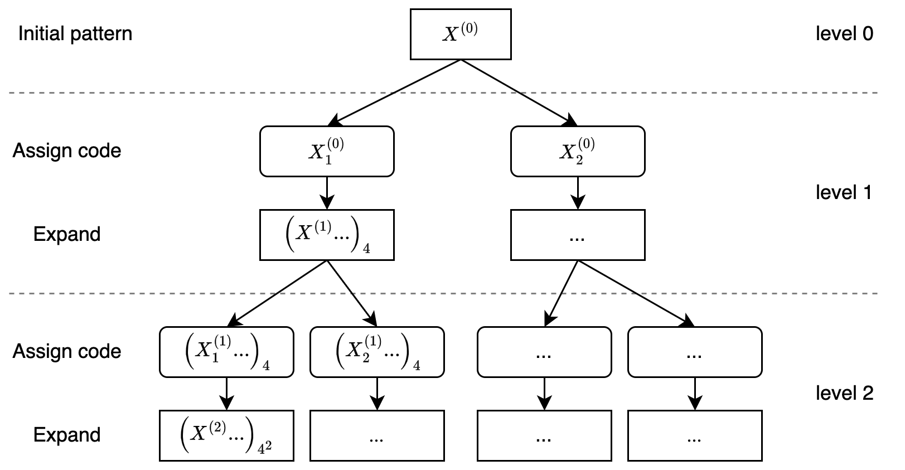

```{r, echo = FALSE}
library(knitr)

knitr::opts_chunk$set(
    error = FALSE,
    tidy  = FALSE,
    message = FALSE,
    warning = FALSE,
    fig.align = "center")

library(grid)
library(sfcurve)
```

We only consider the type of space-filling curve that has a $2^k \times 2^k$ rate. The growth of the curve
can be described in a top-bottom manner, where within a square with fixed size (normally a unit square), the square
is partitioned into four sub-square by euqally split it into two halves on horizonally and verically. Then on each subsquare,
such partitioning is applied recursively. It can also be described in a bottom-top manner, where with a unit square expands into 
four squares by increase 2x both on rows and columns, then for each of the four square, it expands recursively. It is easy to see,
the two ways are identically only with a size factor $n$ (the xx) or $n^2$ (the area).

For easy discussion, we use the expansion mode. When expanding one square to four squares (2x2), there are several ways, such as the z-curve or H-curve.
We requiare the curve can only goes straight, left or right along the four squares without interuptted or crossing 


```{r, echo = FALSE, fig.width = 3*8/5, fig.height = 3}
grid.newpage()
pushViewport(viewport(xscale = c(0, 8), yscale = c(-2.5, 2.5), height = unit(1, "snpc"), width = unit(8/5, "snpc")))
pushViewport(viewport(x = 0, y = 0, width = 1, height = 1, default.units = "native", xscale = c(-1, 1), yscale = c(-1, 1), just = "left"))
grid.segments(c(-0.5, -0.5), c(-0.5, 0.5), c(0.5, 0.5), c(-0.5, 0.5), default.units = "native", gp = gpar(col = "grey", lty = 3))
grid.segments(c(-0.5, 0.5), c(-0.5, -0.5), c(-0.5, 0.5), c(0.5, 0.5), default.units = "native", gp = gpar(col = "grey", lty = 3))
grid.lines(c(0, 0, 0.5), c(-0.5, 0, 0), default.units = "native", arrow = arrow(length = unit(0.2, "native"), angle = 15), gp = gpar(col = "grey"))
grid.points(0, 0, default.units = "native", pch = 16, size = unit(4, "pt"))
grid.text(1, c(0.5), c(-0.5), default.units = "native", gp = gpar(fontsize = 7, col = "grey"), vjust = 1.5)
grid.text(1, c(-0.5), c(0.5), default.units = "native", gp = gpar(fontsize = 7, col = "grey"), hjust = 1.5)
grid.text(0, c(-0.5), c(-0.5), default.units = "native", gp = gpar(fontsize = 7, col = "grey"), hjust = 1.5, vjust = 1.5)
popViewport()

pushViewport(viewport(x = 1, y = 0, width = 2, height = 2, default.units = "native", xscale = c(-1.5, 1.5), yscale = c(-1.5, 1.5), just = "left"))
grid.segments(c(-1, -1, -1), c(-1, 0, 1), c(1, 1, 1), c(-1, 0, 1), default.units = "native", gp = gpar(col = "grey", lty = 3))
grid.segments(c(-1, 0, 1), c(-1, -1, -1), c(-1, 0, 1), c(1, 1, 1), default.units = "native", gp = gpar(col = "grey", lty = 3))
grid.lines(c(-0.5, -0.5, 0.5, 0.5, 1), c(-1, 0.5, 0.5, -0.5, -0.5), default.units = "native", arrow = arrow(length = unit(0.2, "native"), angle = 15), gp = gpar(col = "grey"))
grid.lines(c(-0.5, -0.5, 0.5, 0.5), c(-0.5, 0.5, 0.5, -0.5), default.units = "native", gp = gpar(lwd = 2, col = "black"))
grid.points(c(-0.5, -0.5, 0.5, 0.5), c(-0.5, 0.5, 0.5, -0.5), default.units = "native", pch = 16, size = unit(4, "pt"))
grid.text(0, c(-1), c(-1), default.units = "native", gp = gpar(fontsize = 7, col = "grey"), hjust = 1.5, vjust = 1.5)
grid.text(1:2, c(0, 1), c(-1, -1), default.units = "native", gp = gpar(fontsize = 7, col = "grey"), vjust = 1.5)
grid.text(1:2, c(-1, -1), c(0, 1), default.units = "native", gp = gpar(fontsize = 7, col = "grey"), hjust = 1.5)
grid.text(c("1/2"), c(0), c(1), default.units = "native", gp = gpar(fontsize = 7, col = "grey"), vjust = -0.5)
grid.text(c("1/2"), c(1), c(0), default.units = "native", gp = gpar(fontsize = 7, col = "grey"), hjust = -0.2)
grid.text(1, c(1), c(1), default.units = "native", gp = gpar(fontsize = 7, col = "grey"), hjust = -0.2, vjust = -0.5)
popViewport()

pushViewport(viewport(x = 3.5, y = 0, width = 4, height = 4, default.units = "native", xscale = c(-2, 2), yscale = c(-2, 2), just = "left"))
grid.segments(c(-2, -2, -2, -2, -2), c(-2, -1, 0, 1, 2), c(2, 2, 2, 2, 2), c(-2, -1, 0, 1, 2), default.units = "native", gp = gpar(col = "grey", lty = 3))
grid.segments(c(-2, -1, 0, 1, 2), c(-2, -2, -2, -2, -2), c(-2, -1, 0, 1, 2), c(2, 2, 2, 2, 2), default.units = "native", gp = gpar(col = "grey", lty = 3))
grid.lines(c(-1.5, -1.5), c(-1.5, -2), default.units = "native", gp = gpar(col = "grey"))
grid.lines(c(1.5, 2), c(-1.5, -1.5), default.units = "native", arrow = arrow(length = unit(0.2, "native"), angle = 15), gp = gpar(col = "grey"))
grid.lines(c(-1.5, -0.5, -0.5, -1.5, -1.5, -1.5, -0.5, -0.5, 0.5, 0.5, 1.5, 1.5, 1.5, 0.5, 0.5, 1.5), 
	       c(-1.5, -1.5, -0.5, -0.5, 0.5, 1.5, 1.5, 0.5, 0.5, 1.5, 1.5, 0.5, -0.5, -0.5, -1.5, -1.5),
	       default.units = "native", gp = gpar(lwd = 2, col = "black"))
grid.points(c(-1.5, -0.5, -0.5, -1.5, -1.5, -1.5, -0.5, -0.5, 0.5, 0.5, 1.5, 1.5, 1.5, 0.5, 0.5, 1.5), 
	       c(-1.5, -1.5, -0.5, -0.5, 0.5, 1.5, 1.5, 0.5, 0.5, 1.5, 1.5, 0.5, -0.5, -0.5, -1.5, -1.5),
	       default.units = "native", pch = 16, size = unit(4, "pt"))
grid.text(0, c(-2), c(-2), default.units = "native", gp = gpar(fontsize = 7, col = "grey"), hjust = 1.5, vjust = 1.5)
grid.text(1:4, c(-1, 0, 1, 2), c(-2, -2, -2, -2), default.units = "native", gp = gpar(fontsize = 7, col = "grey"), vjust = 1.5)
grid.text(1:4, c(-2, -2, -2, -2), c(-1, 0, 1, 2), default.units = "native", gp = gpar(fontsize = 7, col = "grey"), hjust = 1.5)
grid.text(c("1/4", "2/4", "3/4"), c(-1, 0, 1), c(2, 2, 2), default.units = "native", gp = gpar(fontsize = 7, col = "grey"), vjust = -0.5)
grid.text(c("1/4", "2/4", "3/4"), c(2, 2, 2), c(-1, 0, 1), default.units = "native", gp = gpar(fontsize = 7, col = "grey"), hjust = -0.2)
grid.text(1, c(2), c(2), default.units = "native", gp = gpar(fontsize = 7, col = "grey"), hjust = -0.2, vjust = -0.5)
popViewport()
popViewport()
```

## Base patterns

The space-filling curve can be generated by recursively extending certain patterns on its sub-structures. Thus, we define 
the following expansion rules from level 0 to level 1. The patterns on level 0 are alled the **base patterns** which contains a single points
and its in-direction and out-direction. 


```{r, fig.width = 8, fig.height = 4.5}
draw_rules_hilbert()
```

For example, base pattern $I$ is on level 0, explicitly denoted as $I^{(0)}$, when it 
expands to level 1 while keep the direction of the curve, There are two options as listed in the diagram. 
As an example here, we choose the first option. Now for the following expansion:

$$
I^{(0)} \rightarrow I^{(1)}_1
$$

```{r, fig.width = 1.3, fig.height = 1.3, echo = FALSE}
grid.newpage()
pushViewport(viewport(xscale = c(-1.5, 1.5), yscale = c(-1.5, 1.5), width = unit(4, "cm"), height = unit(4, "cm")))
grid.points(c(-0.5, 0.5, 0.5, -0.5), c(-0.5, -0.5, 0.5, 0.5), default.units = "native", pch = 16, size = unit(4, "pt"))
grid.lines(c(-0.5, 0.5, 0.5, -0.5), c(-0.5, -0.5, 0.5, 0.5), default.units = "native", gp = gpar(col = "black"))
grid.lines(c(-0.5, -0.5, 0)-0.1, c(-1, -0.5, -0.5)+0.1, default.units = "native", gp = gpar(col = 2), arrow = arrow(angle = 15, length = unit(6, "pt")))
grid.lines(c(0, 0.5, 0.5)+0.1, c(-0.5, -0.5, 0)-0.1, default.units = "native", gp = gpar(col = 3), arrow = arrow(angle = 15, length = unit(6, "pt")))
grid.lines(c(0.5, 0.5, 0)+0.1, c(0, 0.5, 0.5)+0.1, default.units = "native", gp = gpar(col = 4), arrow = arrow(angle = 15, length = unit(6, "pt")))
grid.lines(c(0, -0.5, -0.5)-0.1, c(0.5, 0.5, 1)-0.1, default.units = "native", gp = gpar(col = 5), arrow = arrow(angle = 15, length = unit(6, "pt")))
popViewport()
```

we can describe the curve generation in four steps:

- step 1. bottom in, right out. This is the base pattern $R$ without rotation, thus we denote it as $R^{(0)}$,
- step 2. left in, top out. This is the base pattern $L$ with $90^{\circ}$ clockwise rotation, thus we denote it as $L^{(0),90}$,
- step 3. bottom in, left out. This is the base pattern $L$ without rotation, and we denote it as $L^{(0)}$,
- step 4. right in, top out. This step can be denoted as $R^{(0),-90}$ or $R^{(0),270}$.

Then the expansion can be written as a sequence:

$$
I^{(1)}_1 = R^{(0)}L^{(0),90}L^{(0)}R^{(0),270}
$$

In figure 1, the notatio of levels are removed since it can be easily identified.

## Rotate

Figure 1 only contains base patterns at rotation = 0, but we can easily
define the rations of a pattern or a sequence of patterns.

Denote $X$ as a base pattern, $X \in \{I, R, L, U, C, B, D, P, Q\}$,
and $X^\theta$ where $\theta$ is the rotation regarding to the base state in Figure 1.
$\theta \in \{0, 90, 180, 270\}$ and a positive $\theta$ corresponds to 
clocewise rotation, we have 

$$ (X^{\theta_1})^{\theta_2} = X^{\theta_1 + \theta_2} $$

which means rotating the pattern twice is identical to rotating the pattern once but
with the sum of the two rotations.

Note

$$
X^\theta = X^{\theta \bmod 360}
$$

Rotating a sequence of base patterns is identical to a sequence of rotated base patterns.

$$
(X_1^{\theta_1}X_2^{\theta_2}...X_n^{\theta_n})^\theta'  = X_1^(\theta_1 + \theta') X_2^(\theta_2 + \theta1) ... X_n^(\theta_n + \theta')
$$

By also include all four rotations of the base patterns, Figure 1 contains the complete set of expansion from level 0 to level 1.


## Expanding the curve

Figure 1 only defines the expansion of the curve from level 0 to level 1 (the 0-to-1 expansion). To
expand the curve to higher levels, e.g. to level $k$ ($k > 1$), the 0-to-1 expansion can be applied
recursively. Note a level-$k$ curve is a sequence of four level-$k-1$ curves, which eventually a sequence
of $4^{k-1}$ level-1 curves. As for each base pattern, to expand to level-1, there are two options,
thus there are rules to pick one of the options in the expansion to ensure all the level-1 curves are connected
to their neighbour level-1 curves.

### Transverse mode

All the level-1 curves transverse a $2 \times 2$ grids, thus they all have a
rectangle-shape with an in-direction and an out-direction. Denote the bottom
left and top right have a corner value of 1 and the top left and bottom right
have a corner value of 2.

```{r, echo = FALSE, fig.width = 2, fig.height = 2}
pushViewport(viewport(xscale = c(-1.5, 1.5), yscale = c(-1.5, 1.5)))
grid.segments(c(-1, -1, -1), c(-1, 0, 1), c(1, 1, 1), c(-1, 0, 1), default.units = "native", gp = gpar(col = "grey", lty = 3))
grid.segments(c(-1, 0, 1), c(-1, -1, -1), c(-1, 0, 1), c(1, 1, 1), default.units = "native", gp = gpar(col = "grey", lty = 3))
grid.lines(c(-0.5, -0.5, 0.5, 0.5, 1), c(-1, 0.5, 0.5, -0.5, -0.5), default.units = "native", arrow = arrow(length = unit(0.2, "native"), angle = 15), gp = gpar(col = "grey"))
grid.lines(c(-0.5, -0.5, 0.5, 0.5), c(-0.5, 0.5, 0.5, -0.5), default.units = "native", gp = gpar(lwd = 2, col = "black"))
grid.points(c(-0.5, -0.5, 0.5, 0.5), c(-0.5, 0.5, 0.5, -0.5), default.units = "native", pch = 16, size = unit(4, "pt"))
grid.text(c(1, 1, 2, 2), c(-0.5, 0.5, 0.5, -0.5), c(-0.5, 0.5, -0.5, 0.5), default.units = "native", gp = gpar(col = "grey"),
	hjust = c(2, -1, -1, 2), vjust = c(2, -1, 2, -1))
popViewport()
```


We define the **transverse mode** $\tau$ of the level-1 curve $X^{(1)}$ as a
2-tuple $(c_1, c_2)$ where $c_1$ is the value of the entering corner
and $c_2$ is the value of the leaving corner of $X^{(1)}$:

$$
\tau_{X^{(1)}} = (c_1, c_2), \quad c_1, c_2 \in \{1, 2\}
$$

In Figure 1, $\tau_{X^{(1)}} = (1, 2)$ or $\tau_{X^{(1)}} = (2, 1)$, so we define the complement of a corner value as

$$
\hat{c} = \left\{\begin{matrix}
2 & \text{if }c = 1,\\ 
1 & \text{if }c = 2,\\ 
\end{matrix}\right.
$$

Rotating $X^{(1)}$  $90^\circ$ (either clockwise or reverse clockwise) changes the order of the two
corner values in the tuple, while rotating by $180^\circ$ does not.

$$
\begin{align*}
\tau_{X^{(1), 90k}} &= (c_1, c_2), & \text{if }k\text{ is even}, \\
\tau_{X^{(1), 90k}} &= (\hat{c}_1, \hat{c}_2), & \text{if }k\text{ is odd}, \\
\tau_{X^{(1), 180k}} &= (c_1, c_2) \\
\end{align*}
$$


Let's go back to Figure 1. For each base pattern, there are two level-1 curve that can be expanded. The two curves have different transverse mode.
We code the two level-1 curves according to their transverse mode as:

$$
\begin{align*}
X_1^{(1)} \quad \text{if }\tau_{X^{(1)}} &= (1, 2), \\
X_2^{(1)} \quad \text{if }\tau_{X^{(1)}} &= (2, 1). \\
\end{align*}
$$


### Connect patterns


For two level-1 curves $X^{(1)}$ and $Y^{(1)}$ with transverse modes $(c_1, c_2)$ and $(c_3, c_4)$ (of course $c_2 = \hat{c_1}$, $c_4 = \hat{c_3}$), 
to construct the sequence $XY$, we need to ensure the two curves are connectable.
Since the two curves represented as two square patterns
can only be connected horizontally or vertically, it should fit $c_3 = c_4$,
i.e. with the forms of $\tau_{X^{(1)}} = (1, 2)$ and $\tau_{y^{(1)}} = (2,1)$ or $\tau_{X^{(1)}} = (2, 1)$ and $\tau_{y^{(1)}} = (1,2)$.

From a base pattern, there are two options of level-1 curves. To connect two level-1 curve, we first need to pre-select the expansion code of the first level-1 curve, then the expansion code for the following level-1 curves can be automatically inferred.

Let's denote two level-1 curves $X^{(1),\alpha} Y^{(1),\beta}$, 
we first assign an expansion code to the first curve, say $X_i^{(1),\alpha}$ ($i \in \{1,2\}$), and we define the complement expansion code $j$ as:


$$
j = \left\{\begin{matrix}
1 & \text{if }i = 2,\\ 
2 & \text{if }i = 1.\\ 
\end{matrix}\right.
$$

then the expansion code for $Y^{(1),\beta}$ is determined by $k = (\beta - \alpha)/90$:

$$
\left\{\begin{matrix}
Y^{(1),\beta}_i, & \text{if }k\text{ is even}, \\
Y^{(1),\beta}_j, & \text{if }k\text{ is odd}. \\
\end{matrix}\right.
$$

which means if $\beta-\alpha$ is the even multiple of $90^\circ$, $Y^{(1),\beta}$ has the same expansion code as $X^{(1),\alpha}$, or $90^\circ$, $Y^{(1),\beta}$
has the complement code of $X^{(1),\alpha}$.

so for example, starting from $I^{90}$, to extend it, we choose $I_1^{90}$ with the level 1 form

$$
I_1^{90} = (RL^{90}LR^{270})^{90} = R^{90}L^{180}L^{90}R
$$

To extend to level 2, we have to assign the type code to each of the RLRL to extend, we start from the first pattern R, as there are two options, we use $R_1$, then according to the rules

$$
I_1 = R_1^{90}L_2^{180}L_1^{90}R_2
$$
then by ... we can obtian the final sequence on level 3:

$$
(IRR^{90}L^{180})^{90}(ILL^{270}R^{180})^{180}(RL^{90}LI^{270})^{90}(LR^{270}RI^{90})
= I^{90}R^{90}R^{180}L^{270}I^{180}L^{180}L^{90}RR^{90}L^{180}L^{90}ILR^{270}RI^{90}
$$

If we only want to expand to level 3 then the pattern code in the prevous equation
already corresponds to the base patterns. In this way, with knowing the sequence, the 
ratation is determined and can be removed


$$
I^{90}|srrlsllrrllslrrl
$$

In the direction of approaching, wiht the initial state $I^90$ which means horizontally from left to right,
th esequence is

- $s$ go straight
- $r$ turn right
- $l$ turn left

horizontally from left to right, the moving sequence is straight -> right->right->left->straight->...


When expanding from level 1 to level 2, the four corners are extended to a grid according to the 0-1 rule, which is

$$

$$

As the selection of 1 and 2 ensures that when extending form level 1 to level 2, the curve is still connected,i.e.

$$C2 = C11C12C13C14$$

where $C_2$ is the curve at level 2, C1. are the level 1 curve extended form the four corners and they are connected
1.

One important of such expansion is the transverse mode (e.g. bottom-in and top-out) is unchanged in such expansion, this ensures that the curves between sub-square are connected. Thus

$$
I^{(k)}_1 = R^{(k-1)}L^{(k-1),90}L^{(k-1)}R^{(k-1),270}
$$

where $k$ is the level of the curve, or the simple way

$$
I_1 = RL^{90}LR^{270}, k \in \{1, 2, ...\}
$$

The diagram contains the complete set of expansion from 0 to 1 with initial rotation of 0.
The selection of xx is based on that on level 0, the curve starts from the bottom and the 
first step is bottom up. Letters R and L means turn right or left. Other letters
are selected based on the shapes of letters and xxx. Only B and D do not start
from bottom and up, but the initial shape xxx.


## Expand the curve

Let's start from a single base pattern as the intiali pattern. To recursively expand
the curve, since each base pattern has two types of xxx, thus, on easy step, we need
to choose the expanded pattern s...

```{r, out.width = "70%"}

```

as shown, on each step, xxx, thus on a level $k$, the total number of 
curves are $2^k$. Taking $R$ as the initial patter and on level 3, the
total set of curves are 8:

Note the oritentation of $R$, bottom in and right out.

```{r, fig.width = 8, fig.height = 4}
draw_multiple_curves(
	sfc_hilbert("R", code = c(1, 1, 1)),
	sfc_hilbert("R", code = c(1, 1, 2)),
	sfc_hilbert("R", code = c(1, 2, 1)),
	sfc_hilbert("R", code = c(1, 2, 2)),
	sfc_hilbert("R", code = c(2, 1, 1)),
	sfc_hilbert("R", code = c(2, 1, 2)),
	sfc_hilbert("R", code = c(2, 2, 1)),
	sfc_hilbert("R", code = c(2, 2, 2)),
	nrow = 2)
```


Then, with knowing the intial patter and the tye of each step, the 
curve is fixed. Then we can describe a $2^k \times 2^k$ curve
denoted as $\mathcal{C}_k$

$$
\mathcal{C}_k := X^{(0)}|\pi_1 \pi_2 ... \pi_k, \pi_i \in \{1, 2\}
$$


note the sequence $(\pi_1 \pi_2, ..., \pi_k)$ can be represented as 
a sequence of binary bits, it can be xxx into an integer

$$
X|111 = X|0_3 \\
X|121 = X|2_3 \\
X|222 = X|7_3
$$


We can generate the Hilbert curve, Moore curve and $\beta\Omega$  curve as follows:


```{r, fig.width = 6, fig.height = 2}
p1 = sfc_hilbert("I", code =  "111", rot = -90)
p2 = sfc_hilbert("U", code =  "211", rot = 180)
p3 = sfc_hilbert("C", code = "2121", rot = -90)

draw_multiple_curves(p1, p2, p3)
```

In the sequence of type code on levels:

$$
\pi_1, \pi_2, ..., \pi_{k-1}, \pi_{k}
$$

The type code on the left of the sequence correspond to the higher level organization of the folding, and codes
on the right side correspond to the lower level. Particularlly, the last two type codes which construct the unit of 4x4
is the most observable unit in the curve. If we define the following shape as the basic unit of Hilbert curve

```{r, fig.width = 2, fig.height = 2}
plot(sfc_hilbert("R", "11"), extend = FALSE)
```

we can have the following curve with the hilbert unit

$$
\mathcal{H}_k := X^{\theta}|\pi_1 \pi_2 ... \pi_{k_-1} \pi_k), where \pi_{k-1} = \pi_k, \theta \in \{0, 90, 180, 270\}
$$

on level 2, only $\{I, R, L, U\}$.


We can also define the $\beta$ unit and the $\Omega$ unit as the following two

```{r, fig.width = 4, fig.height = 2}
draw_multiple_curves(
	sfc_hilbert("L", "21"),
	sfc_hilbert("I", "12", rot = -90)
)
```


genral $\beta\Omega$ curve (k >= 3)

$$
\mathcal{B}_k := X^{\theta}(\pi_1 \pi_2 ... \pi_{k_-1}, \pi_k), where \pi_{k-1} \ne \pi_k, \theta \in \{0, 90, 180, 270\}
$$

A specific base pattern can induce $2^k$ differnet forms of curves on level $k$, so the total number of the forms for all 9 base patterns
with 4 rotations are

$$
4 \times 9 \times 2^k = 36 \times 2^k
$$

Prove it contains all form sof "open" curves.

Let's go back to the sequence of a curve on level k

$$
\mathcal{C}_k = X^{(0)}|\pi_1 \pi_2 ... \pi_k, \pi_i \in \{1, 2\}
$$

The equation represents the curve starts from $X^{(0)}$ and expands k xxx. We can merge $X^{(0)}$ and the first expansion as the initial pattern,
and xx k-1 times, written as:

$$
\mathcal{C}_k = (X^{(0)}|\pi_1) | \pi_2 ... \pi_k, \pi_i \in \{1, 2\}
$$

Similarll we can have move any $\pi_i$ to the left side of $|$:

$$
\mathcal{C}_k = (X^{(0)}|\pi_1 ... \pi_i) | \pi_(i+1) ... \pi_k
$$

or we can write in a pattern, extend 1, a new pattern ,,...

$$
\mathcal{C}_k = {[(X^{(0)}|\pi_1)| \pi_2] | ...}| \pi_k
$$

or

$$
\mathcal{C}_k = X^{(0)}|\pi_1 | \pi_2 | ... | \pi_k
$$

```{r, fig.width= 12, fig.height = 2.5}
initial = sfc_seed("R")
draw_multiple_curves(
	sfc_hilbert(initial, "1212"),
	sfc_hilbert(sfc_hilbert(initial, "1"), "212"),
	sfc_hilbert(sfc_hilbert(initial, "12"), "12"),
	sfc_hilbert(sfc_hilbert(initial, "121"), "2"),
	sfc_hilbert(sfc_hilbert(initial, "1212"), NULL),
	sfc_hilbert(sfc_hilbert(sfc_hilbert(sfc_hilbert(initial, "1"), "2"), "1"), "2")
)
```

we can also merge neighbouring xxx , e.g.

$$
\mathcal{C}_k = X^{(0)}| (\pi_1 \pi_2) | (\pi_3 \pi_4) | ... | (\pi_{k-1} \pi_k
$$

This means, instead of doing a 2x2 expansion, now we do a 4x4 expansion, and each expansion mode
is determined by $(\pi_{i-1} \pi_i$

$$
\lambda = \pi \pi' \\
\lambda = \left\{\begin{matrix}
& 1, \pi \pi' = 1 1 \\
& 2, \pi \pi' = 1 2 \\
& 3, \pi \pi' = 2 1 \\
& 4, \pi \pi' = 2 2 \\
\end{matrix}\right.
$$

$$
X|\lambda_1 lambda_2 ... = X|\pi_1\pi_1' \pi_2 \pi_2' ...
$$

```{r}
initial = sfc_hilbert("R")
sfc_4x4 = function(initial, code) {
	map = c("1" = "11", "2" = "12", "3" = "21", "4" = "22")
	code = strsplit(code, "")[[1]]
	code2 = paste(map[code], collapse = "")
	sfc_hilbert(initial, code2)
}
draw_multiple_curves(
	initial,
	sfc_4x4(initial, "1"),
	sfc_4x4(initial, "3"),
	sfc_4x4(initial, "11"),
	sfc_4x4(initial, "13")
)
```

In some xxx, instead of using single point as the base pattern, some xx use the patterns on level 1, i.e. 2x2 pattern as the base pattern

$$
\mathcal{C}_k = X^{(0)}| (\pi_1))| \pi_2 ... \pi_{k-1} \pi_k
$$

```{r}
initial = sfc_hilbert("R", 1)
draw_multiple_curves(
	initial,
	sfc_hilbert(initial, "1"),
	sfc_hilbert(initial, "11")
)
```

And to get a full "base pattern" of such 

$$
X^{(1),\theta}_\pi, \theta \in \{0, 90, 180, 270\}, \pi \in \{1, 2\}
$$

## Recursive pattern

Denote a curve as a sequence on level k with 4^k patterns

$$
(X_1 X_2 ... X_{4^k}) = (X_1 ... X_{4^{k-1}})
(X_{4^{k-1} + 1} ... X_{2 \cdot 4^{k-1}})
(X_{2 \cdot 4^{k-1}+1}...X_{3 \cdot 4^{k-1}})
(X_{3 \cdot 4^{k-1} + 1} ... X_{3 \cdot 4^{k}})
$$

If each xxx of k-1 can be reduced to a single point

P(k) - P(k-1) = p(1)

P(k) - P(1) = P(k-1)

the we call ...

assuption, a recursive patttern has the following form:

$$
X^{\theta}(t_1 t_2, ..., t_{k_-1}, t_k), t_{k-1}, t_1 = t_2 = ... = t_{k-1}
$$

## Complex initial

In the previous curve defintion, X is xx as a single base pattern. There is no restriction ofxx X can be a list of sequence with valid struture.

In the following, the global structure is $I^{90}RL$, horizonal staring from left, go straight, then turn right and turn left

```{r, fig.width = 4, fig.height = 4}
p = sfc_hilbert("IRL", code = c(1, 1, 1, 1), rot = 90)
plot(p)
```

```{r, fig.width = 2, fig.height = 2}
p = sfc_seed("LLLILILIILIILIIILIIILIIII", universe = sfc_universe(SFC_RULES_HILBERT))
plot(p, grid = TRUE)
```


```{r, fig.width = 5, fig.height = 5}
p2 = sfc_hilbert(p, code = c(1, 1, 1, 1))
plot(p2)
```

WHen constructing a complex initial pattern sequence, $U$ can only be used to form $UU^{180}$,

$C$ is self-closed and cannot be connected, $B$, $D$, $P$ and $Q$ are half-closed and can
only be used as the start or end pattern of a sequence.

Note the initiali squence can only be consturcted by "straight", "lef" and "right". crossing is not allowed.


```{r, fig.width = 10, fig.height = 1}
p = sfc_hilbert("IIIIIIIIII", code = "11111", rot = 90)
plot(p)
```

We can make e.g. circular transformation of the original coordinates

```{r}
loc = sfc_segments(p)
head(loc)
```

```{r, fig.width = 8, fig.height = 8, eval = FALSE}
n = nrow(loc)
library(circlize)
circos.par(gap.degree = 0, cell.padding = c(0, 0))
circos.initialize(sectors = "foo", xlim = range(loc[, 1]))
col_fun = colorRamp2(seq(1, n, length = 11), RColorBrewer::brewer.pal(11, "Spectral"))
circos.track(ylim = range(loc[, 2]), panel.fun = function(x, y) {
	circos.segments(loc[1:(n-1), 1], loc[1:(n-1), 2], loc[2:n, 1], loc[2:n, 2], col = col_fun(1:(n-1)), lwd = 2)
}, track.height = 0.5, bg.border = NA)
circos.clear()
```

```{r, fig.width = 8, fig.height = 8, eval = FALSE}
p = sfc_hilbert()(strrep("I", 30), type = "11111", rot = 90)
loc = sfc_segments(p)
n = nrow(loc)
col_fun = colorRamp2(seq(1, n, length = 11), RColorBrewer::brewer.pal(11, "Spectral"))

library(spiralize)

spiral_initialize(xlim = range(loc[, 1]), start = 360, end = 360*3)
spiral_track(ylim = range(loc[, 2]), height = 0.95, background = FALSE)
spiral_segments(loc[1:(n-1), 1], loc[1:(n-1), 2], loc[2:n, 1], loc[2:n, 2], gp = gpar(col = col_fun(1:(n-1)), lwd = 1))
```

## partial curve

For a curve xxx . Internally, they are only abstracted as a sequence with no requirement of being square.

```{r}
p = sfc_hilbert("R", "11111")
length(p)
plot(p[200:400])
```


## Locality


```{r, fig.width = 8, fig.height = 8, eval = FALSE}
library(ComplexHeatmap)

tl = lapply(1:2^4 - 1, int_to_binary, 4)

ml = lapply(tl, function(t) {
	p = sfc_hilbert("R", t+1)
	as.matrix(dist(sfc_segments(p)))
})

ml2 = lapply(ml, function(x) x-ml[[1]])

pl = lapply(seq_along(ml), function(i) {
	if(i == 1) {
		grid.grabExpr(draw(Heatmap(ml[[i]], cluster_rows = F, cluster_columns = F, show_row_names = F, show_column_names = F, use_raster = TRUE, show_heatmap_legend = FALSE)))	
	} else {
		grid.grabExpr(draw(Heatmap(ml2[[i]], col = circlize::colorRamp2(c(-10, 0, 10), c("green", "white", "red")), cluster_rows = F, cluster_columns = F, show_row_names = F, show_column_names = F, use_raster = TRUE, show_heatmap_legend = FALSE)))	
	}
})
plot_grid(plotlist = pl, nrow = 4)


ml = lapply(c("I", "R", "L", "U", "C", "B", "D", "P", "Q"), function(x) {
	p = sfc_hilbert(x, c(1, 1, 1, 1))
	as.matrix(dist(sfc_segments(p)))
})

ml2 = lapply(ml, function(x) x-ml[[1]])

pl = lapply(seq_along(ml), function(i) {
	if(i == 1) {
		grid.grabExpr(draw(Heatmap(ml[[i]], cluster_rows = F, cluster_columns = F, show_row_names = F, show_column_names = F, use_raster = TRUE, show_heatmap_legend = FALSE)))	
	} else {
		grid.grabExpr(draw(Heatmap(ml2[[i]], col = circlize::colorRamp2(c(-10, 0, 10), c("green", "white", "red")), cluster_rows = F, cluster_columns = F, show_row_names = F, show_column_names = F, use_raster = TRUE, show_heatmap_legend = FALSE)))	
	}
})
plot_grid(plotlist = pl, nrow = 3)
```


## Flip and reverse

The design of the diagram is to let all forms of the curve can be expanded only by rotation, i.e. without leaving
the plate (flipping) or modify the sequence (reverse). However, we can define the flipping horizontal, vertical and
by the diagonal.

Flippping the base pattern can be easily obtained, here we only focused on a sequence of patterns. Observing the diagram,
in the expandiong step, only the three base pattersn of $I$, $L$ and $R$ are used. Thus in the following, we
only restructed the notation $X$ to the set $\{I, L, R\}$.

### Horizontal flip

We first calculate the horizontal flipping of a single base pattern:

$$ 
\begin{align*}
\mathrm{Flip}_\mathrm{h}(I^\alpha) &= I^\alpha, & \alpha \in \{0, 180\}, \\
\mathrm{Flip}_\mathrm{h}(I^\beta) &= I^{\beta + 180}, & \beta \in \{90, 270\}, \\
\mathrm{Flip}_\mathrm{h}(R^\alpha) &= L^\alpha, & \alpha \in \{0, 180\}, \\
\mathrm{Flip}_\mathrm{h}(R^\beta) &= L^{\beta + 180}, & \beta \in \{90, 270\}, \\
\mathrm{Flip}_\mathrm{h}(L^\alpha) &= R^\alpha, & \alpha \in \{0, 180\}, \\
\mathrm{Flip}_\mathrm{h}(L^\beta) &= R^{\beta + 180}, & \beta \in \{90, 270\}. \\
\end{align*}
$$

Then flipping a sequence of base patterns is a sequencing of individual flipping base patterns:

$$
\mathrm{Flip}_\mathrm{h}(X_1 X_2 ...) = \mathrm{Flip}_\mathrm{h}(X_1)\mathrm{Flip}_\mathrm{h}(X_2)...
$$


```{r, fig.width = 4, fig.height = 2}
draw_multiple_curves(
	p, sfc_hflip(p), 
	nrow = 1)
```


### Vertical flip

Vertical flipping can be constructed in the similar way as horizontal flipping, or it can be simply
constructed by first rotating the pattern $180^\circ$ then horizontal flipping:

$$
\begin{align*}
\mathrm{Flip}_\mathrm{v}(X^\theta) &= \mathrm{Flip}_\mathrm{h}((X^\theta)^{180}) \\
     &= \mathrm{Flip}_\mathrm{h}(X^{\theta+180})
\end{align*}
$$

Rotation and horizontal flip can be swtiched:

$$
\begin{align*}
\mathrm{Flip}_\mathrm{v}(X^\theta) &= (\mathrm{Flip}_\mathrm{h}(X^\theta))^{180}
\end{align*}
$$

```{r, fig.width = 8, fig.height = 2}
draw_multiple_curves(
	p, sfc_vflip(p), sfc_rotate(p, 180), sfc_rotate(sfc_hflip(p), 180), 
    nrow = 1)
```

it is easy to seee

$$
\begin{align*}
\mathrm{Flip}_\mathrm{h}(\mathrm{Flip}_\mathrm{h}(X)) &= \mathrm{Flip}_\mathrm{v}(\mathrm{Flip}_\mathrm{v}(X)) = X \\
\mathrm{Flip}_\mathrm{v}(\mathrm{Flip}_\mathrm{h}(X)) &= \mathrm{Flip}_\mathrm{h}(\mathrm{Flip}_\mathrm{v}(X)) = X^{180}
\end{align*}
$$

```{r, fig.width = 6, fig.height = 2}
draw_multiple_curves(
	p, sfc_hflip(sfc_hflip(p)), sfc_vflip(sfc_vflip(p)), 
	nrow = 1)
draw_multiple_curves(
	sfc_rotate(p, 180), sfc_vflip(sfc_hflip(p)), sfc_hflip(sfc_vflip(p)), 
	nrow = 1)
```

Vertical flipping can also be expanded to individual base patterns:

$$
\mathrm{Flip}_\mathrm{v}(X_1 X_2 ...) = \mathrm{Flip}_\mathrm{v}(X_1)\mathrm{Flip}_\mathrm{v}(X_2)...
$$

### Diagonal flipping

There are two types of diagonal flippig: against the diagonal with slop of 1 (bottomleft - topright) and -1 (topleft - bottomright).

$$
\begin{align*}
\mathrm{Flip}_\mathrm{d}^1(X^\theta) &= \mathrm{Flip}_\mathrm{h}(X^{\theta - 90}) = \mathrm{Flip}_\mathrm{v}(X^{\theta + 90}) \\
\mathrm{Flip}_\mathrm{d}^{-1}(X^\theta) &= \mathrm{Flip}_\mathrm{h}(X^{\theta + 90}) = \mathrm{Flip}_\mathrm{v}(X^{\theta - 90})
\end{align*}
$$

```{r, fig.width = 8, fig.height = 2}
draw_multiple_curves(
	p, 
    sfc_dflip(p, 1), 
    sfc_hflip(sfc_rotate(p, -90)), 
    sfc_vflip(sfc_rotate(p, 90))
)
draw_multiple_curves(
	p, 
    sfc_dflip(p, -1), 
    sfc_hflip(sfc_rotate(p, 90)), 
    sfc_vflip(sfc_rotate(p, -90))
)
```

Also

$$
\mathrm{Flip}_\mathrm{d}^1(\mathrm{Flip}_\mathrm{d}^{1}(X)) = \mathrm{Flip}_\mathrm{d}^{-1}(\mathrm{Flip}_\mathrm{d}^{-1}(X)) = X
$$

```{r, fig.width = 6, fig.height = 2}
draw_multiple_curves(
	p, 
    sfc_dflip(sfc_dflip(p, 1), 1), 
    sfc_dflip(sfc_dflip(p, -1), -1)
)
```

and 

$$
\mathrm{Flip}_\mathrm{d}^{-1}(\mathrm{Flip}_\mathrm{d}^{1}(X)) = \mathrm{Flip}_\mathrm{d}^{1}(\mathrm{Flip}_\mathrm{d}^{-1}(X)) = X^{180}
$$

```{r, fig.width = 6, fig.height = 2}
draw_multiple_curves(
	sfc_rotate(p, 180), 
    sfc_dflip(sfc_dflip(p, 1), -1), 
    sfc_dflip(sfc_dflip(p, -1), 1)
)
```

Diagonal flipping can also be expanded to individual base patterns:
$$
\mathrm{Flip}_\mathrm{d}(X_1 X_2 ...) = \mathrm{Flip}_\mathrm{d}(X_1)\mathrm{Flip}_\mathrm{d}(X_2)...
$$

### Reverse

Globally, the complete sequence is reversed, also individual patterns are also adjusted.

$$
\mathrm{Rev}(X_1 X_2 ... X_n) = (X'_n ... X'_2 X'_1)
$$

where 

$$
X'_i = \left\{\begin{matrix}
I^{\theta_i + 180} & \text{if } X_i = I^{\theta_i},\\ 
L^{\theta_i - 90} & \text{if } X_i = R^{\theta_i},\\ 
R^{\theta_i + 90} & \text{if } X_i = L^{\theta_i}.\\ 
\end{matrix}\right. i \in \{1, ..., n\}
$$

If flipping and reverse are also supported, the patterns at level = 1 can be represented by each other, e.g.

$$
\begin{align*}
I^{(1)}_2 &= \mathrm{Flip}_\mathrm{h}(I^{(1)}_1) \\
L^{(1)}_2 &= \mathrm{Flip}_\mathrm{h}(R^{(1)}_1) \\
L^{(1)}_1 &= \mathrm{Rev}((R^{(1)}_1)^{90}) \\
R^{(1)}_2 &= \mathrm{Rev}(\mathrm{Flip}_\mathrm{d}^{-1}(R^{(1)}_1))
\end{align*}
$$

As you can see, flippping and reversing increase the complexity of interpretation, thus we considered both flip and xxx 
and only allows rotation when expanding the curve.

